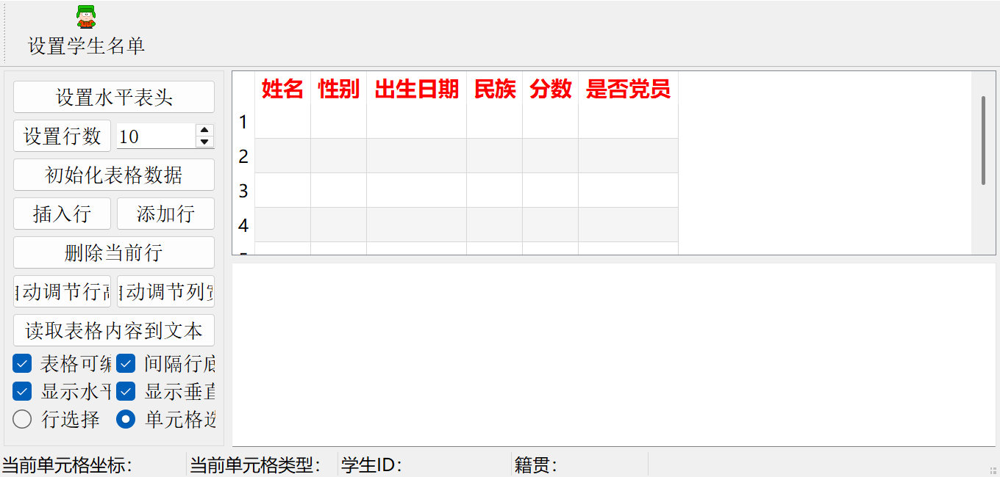
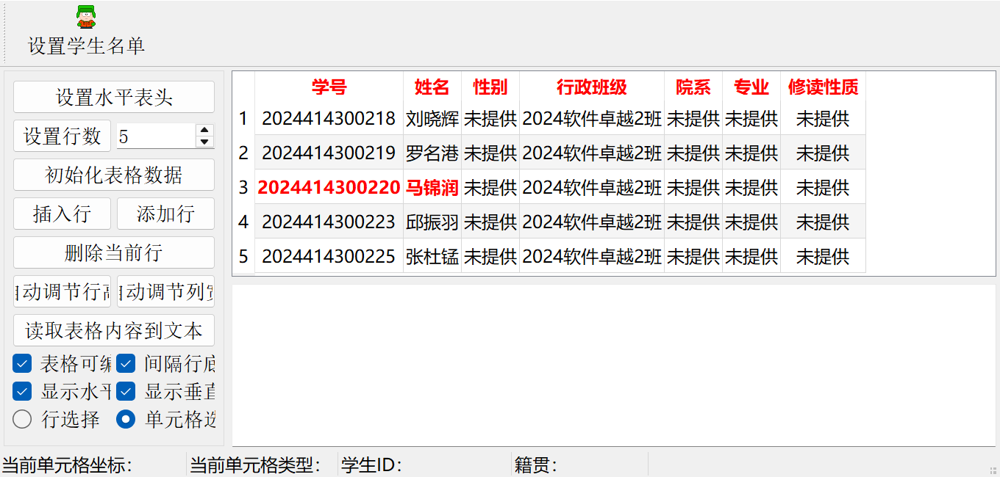
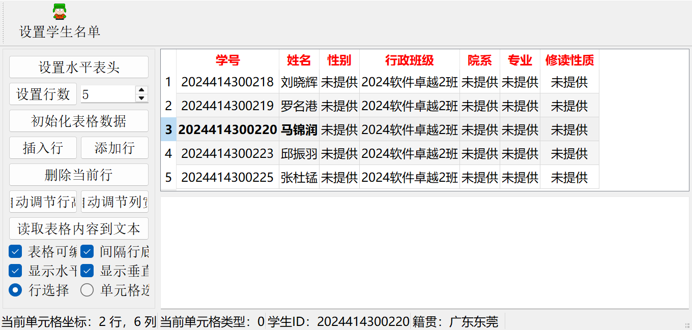

# samp4_13TableWidget

Qt 5 Widgets 作业：使用工具栏动作设置学生名单，并在状态栏显示选中学生的籍贯。

## 运行

使用 Qt Creator 打开 `samp4_13.pro`，选择 Qt 5 的桌面构建套件后编译运行。点击工具栏的“设置学生名单”，表格会显示本人及点名册中前后各两位同学，共 5 行、7 列。本人学号和姓名显示为红色粗体。选中任意一列时，状态栏显示该行学生的籍贯。

`actSetStudentList` 定义在 `mainwindow.ui` 中，可通过 Qt Designer 的 Action Editor 编辑。工具栏使用该动作生成 QToolButton。姓名 item 的 `Qt::UserRole` 保存籍贯，状态栏的 `labNativePlace` 显示该数据。

## 数据

学号、姓名及行政班级来自所提供的周一点名册，按学号 `2024414300220` 对应记录及前后各两行提取。附件没有性别、院系、专业和修读性质，这四列显示“未提供”。籍贯为作业演示值，不代表真实个人资料。原始点名册不随代码上传。

## 截图

设置名单前（先点击“设置水平表头”）：

点击“设置学生名单”后，尚未选中行：

选中本人所在行，状态栏显示示例籍贯：

## 测试

使用 Qt Creator 打开 `tests/studentlist.pro`，编译并运行 QtTest 测试。覆盖工具栏动作、5 行源数据、7 列表头、红色粗体、籍贯关联、重复加载以及原有按钮与名单的兼容行为。

已使用 Qt 5.12.11 和 MinGW 7.3.0 验证。
